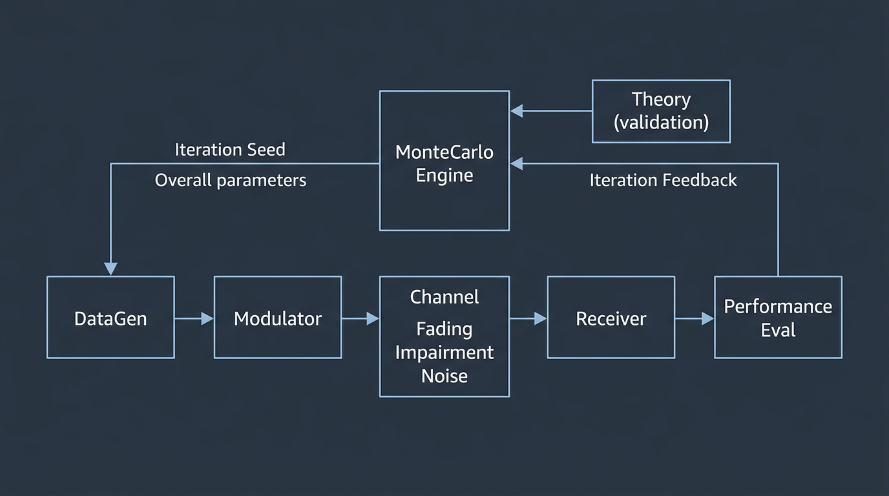
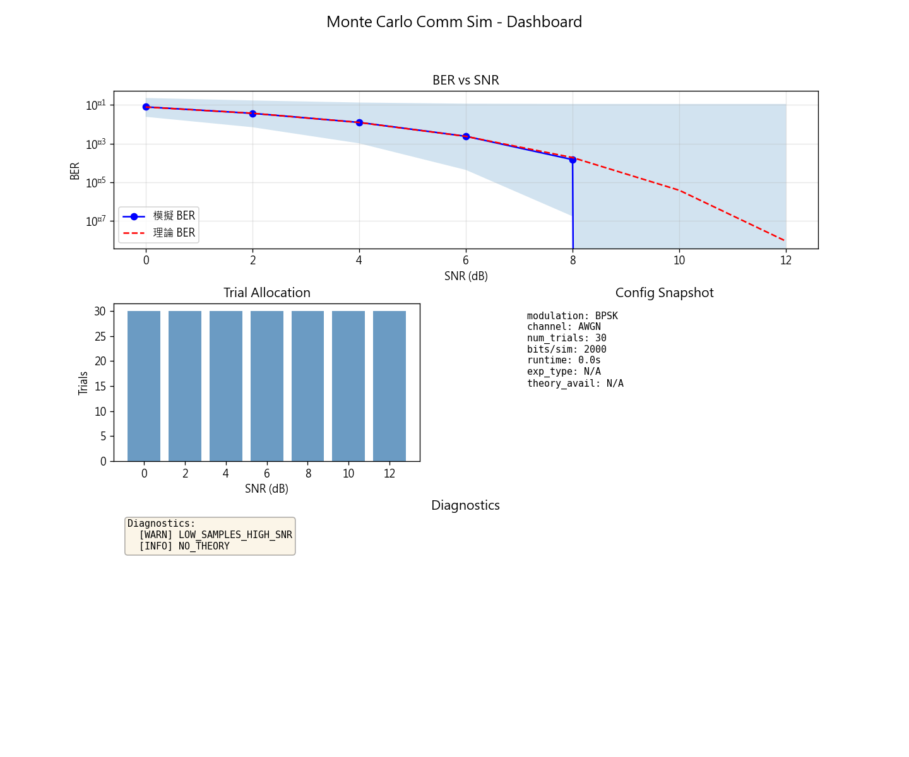
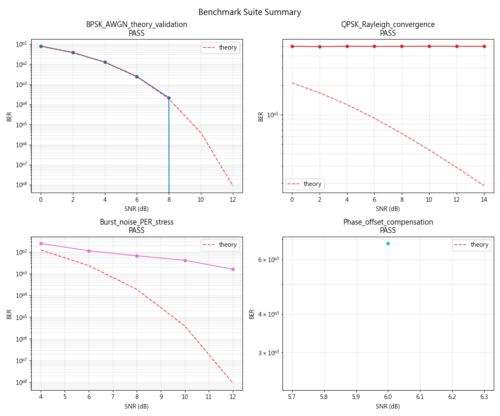
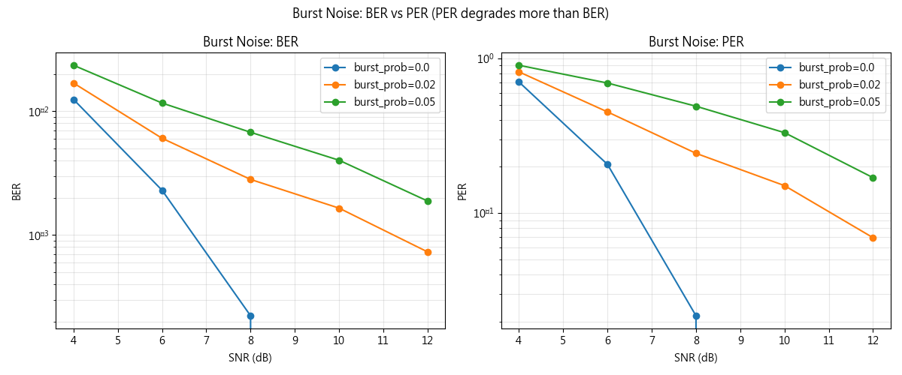

# 蒙地卡羅通訊效能評估系統

> **一句話定位**：以蒙地卡羅方法為核心的數位通訊鏈路效能評估平台，支援多種調變、通道、擾動與自適應抽樣，具備理論驗證、實驗管理與 packet-level 分析能力。

一般通訊模擬常只停留在 BER 曲線；本系統進一步處理**理論驗證**、**CI-based stopping**、**adaptive sampling**、**packet-level stress** 與 **dashboard 輸出**。目標是讓模擬不只可跑，還可驗證、可重現、可比較。

---

## 核心特色

- **多調變、多通道、多擾動** — BPSK/QPSK/8-PSK/16-QAM × AWGN/Rayleigh/Rician × phase/freq offset、burst noise
- **理論對照與 reference-grade 測試** — closed-form 理論驗證、Benchmark Suite 回歸
- **CI-based stopping 與 adaptive sampling** — Wilson score 信賴區間、theory-guided / empirical 自適應抽樣
- **Benchmark suite 與 dashboard 輸出** — 一頁式 dashboard、四案總覽、自動產出
- **Packet-level 壓力分析** — Burst noise、Block fading 對 BER/PER 影響

---

## 快速開始

```bash
pip install -r requirements.txt
python main.py
```

```python
from mc_comm_system import SimulationConfig, MonteCarloEngine, Visualizer

config = SimulationConfig(
    modulation="BPSK",
    channel="AWGN",
    snr_db_range=(0, 12),
    bits_per_simulation=5000,
    num_trials=50,
)
engine = MonteCarloEngine(config)
results = engine.run()
Visualizer().plot_ber_vs_snr(results)
```

---

## 系統架構



<details>
<summary>ASCII 架構圖（fallback）</summary>

```
┌─────────────────────────────────────────────────────────────────┐
│  DataGen → Modulator → Channel (Fading+Impairment+Noise) → Rx   │
│       ↑                                              ↓          │
│  MonteCarlo Engine ←────────────────────── Performance Eval   │
│       ↑                    Theory (validation)                   │
└─────────────────────────────────────────────────────────────────┘
```

</details>

**完整架構與資料流**：見 [docs/ARCHITECTURE.md](docs/ARCHITECTURE.md)（含通訊鏈路圖、experiment/artifacts/reports 資料流）

---

## Benchmark Suite

| 案例 | 說明 | 驗證 |
|------|------|------|
| BPSK_AWGN_theory_validation | BPSK + AWGN 理論驗證 | 相對誤差 < 50% |
| QPSK_Rayleigh_convergence | QPSK + Rayleigh 收斂 | min_trials |
| Burst_noise_PER_stress | Burst noise + PER 壓力 | min_trials |
| Phase_offset_compensation | Phase offset 補償比較 | min_trials |

```bash
python run_benchmark.py
```

產出：`benchmark_results/benchmark_summary.txt`、`benchmark_summary_dashboard.png`

---

## 產出範例

每次實驗自動產出一頁式 dashboard，含 BER 曲線、理論疊加、CI band、trial 分配、config 與診斷：



Benchmark 四案總覽與 Packet-level 壓力分析（執行 `run_benchmark.py`、`run_packet_stress.py` 產出）：





---

## Packet Stress 範例

```bash
python run_packet_stress.py
```

產出：
- `burst_ber_per_dashboard.png`：Burst noise 對 BER/PER 圖
- `block_fading_dashboard.png`：Fast vs Block fading PER 圖
- `packet_stress_conclusions.txt`：結論摘要

---

## Theory-Guided vs Empirical Adaptive

| 模式 | 方法 | 適用情境 |
|------|------|----------|
| **Theory-guided** | `run_adaptive(use_theory=True)` | 有理論公式時，以 relative_error 為目標分配樣本 |
| **Empirical** | `run_adaptive_empirical()` | 無理論時，以 standard error 為目標 |

```python
# 有理論：BPSK/AWGN
r = engine.run_adaptive(
    target_relative_error=0.2,
    use_theory=True,
)

# 無理論：16QAM/Rayleigh
r = engine.run_adaptive_empirical(
    target_se=5e-3,
    min_trials=30,
)
```

---

## 實驗輸出結構

```
experiments/{exp_id}/
├── config.json
├── metadata.json      # schema_version, experiment_type, theory_available
├── results.json
├── report.txt
├── artifacts/
├── logs/diagnostics.txt
└── figures/
    ├── ber_vs_snr.png
    └── dashboard.png
```

---

## 完整報告

產生完整技術報告與結果摘要，自動輸出 BER、比較圖與收斂曲線，適用於 benchmark 回歸與專題報告整理：

```bash
# 一鍵產生（含主程式 + Benchmark + Packet Stress）
產生完整報告.bat

# 或僅主程式
python generate_full_report.py
```

產出：`docs/完整報告.txt`、`report_figures/`、`benchmark_results/`、`packet_stress_results/`、`docs/images/`

---

## 限制與假設

**必讀**：[docs/LIMITATIONS.md](docs/LIMITATIONS.md)

- Uncoded link only
- Coherent detection 假設
- 理論支援範圍有限（見文件）
- CI stopping 極端區間限制
- Impairment pipeline 順序固定

---

## 測試

```bash
python -m pytest tests/ -v
```

---

## 檔案一覽

| 腳本 | 用途 |
|------|------|
| `main.py` | 互動選單 |
| `generate_full_report.py` | 完整報告（主程式 + Benchmark + Packet Stress） |
| `產生完整報告.bat` | 一鍵產生完整報告 |
| `run_benchmark.py` | 基準實驗回歸 |
| `run_packet_stress.py` | Packet-level 壓力故事線 |
